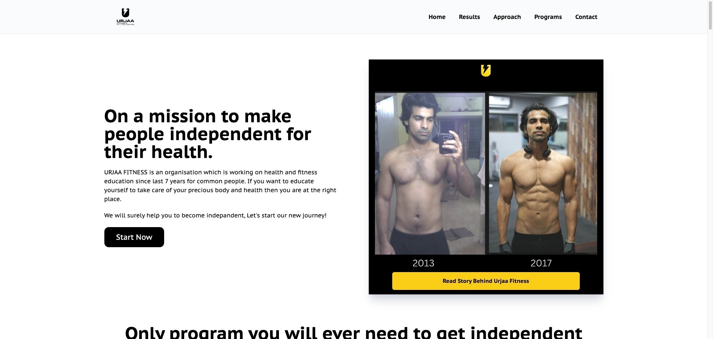
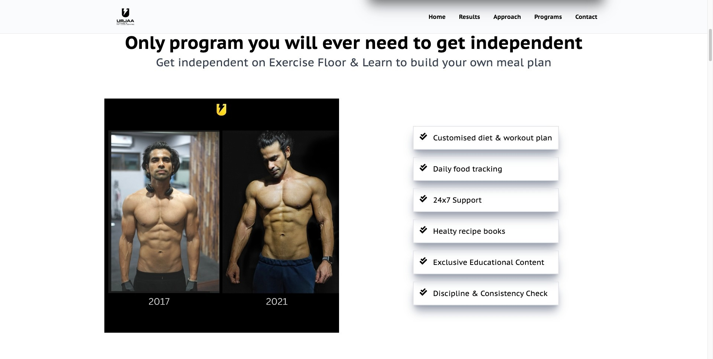
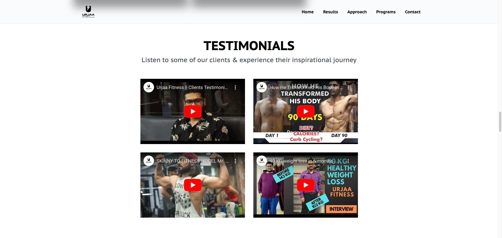
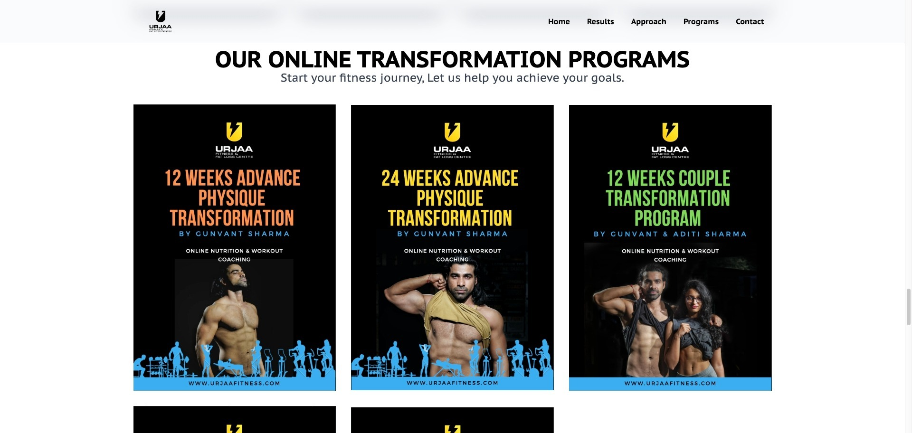

Here is a simple fitness landing page.

Technologies used- React, Tailwind CSS, Type-forms for enquires

[Website-Demo]('https://website.urjaafitness.com/')&nbsp;&nbsp;

Simple Component Design-&nbsp;&nbsp;

&nbsp;&nbsp;

Here are some screenshots-

&nbsp;&nbsp;

&nbsp;&nbsp;

&nbsp;&nbsp;

&nbsp;&nbsp;

For more- check the live version of the website. Thanks

[Website-Demo]('https://website.urjaafitness.com/')&nbsp;&nbsp;

# Getting Started with Create React App

This project was bootstrapped with [Create React App](https://github.com/facebook/create-react-app).

## Available Scripts

In the project directory, you can run:

### `npm start`

Runs the app in the development mode.\
Open [http://localhost:3000](http://localhost:3000) to view it in your browser.

The page will reload when you make changes.\
You may also see any lint errors in the console.

### `npm run build`

Builds the app for production to the `build` folder.\
It correctly bundles React in production mode and optimizes the build for the best performance.

The build is minified and the filenames include the hashes.\
Your app is ready to be deployed!

See the section about [deployment](https://facebook.github.io/create-react-app/docs/deployment) for more information.
